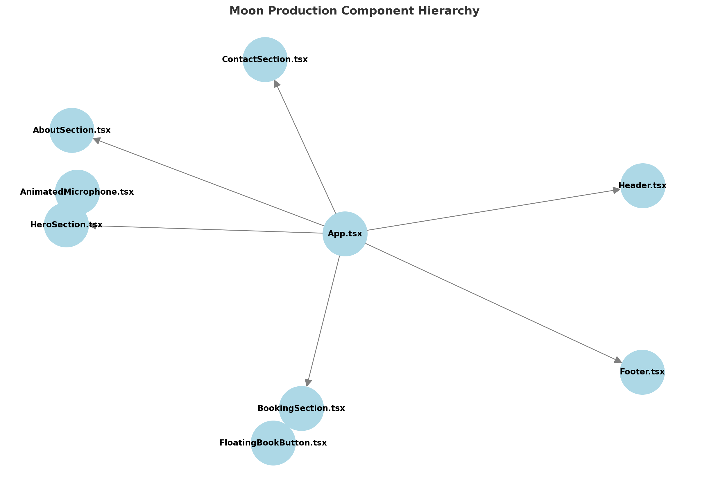
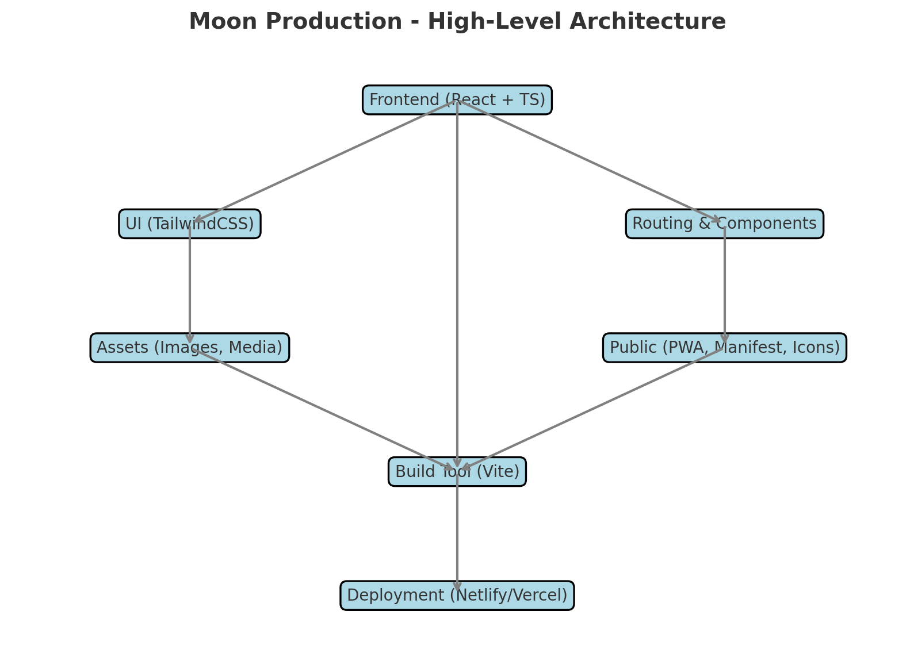

# 🎶 Moon Production


---

## 📑 Table of Contents

- [📖 Overview](#-overview)
- [⚡ Quickstart](#-quickstart)
- [✨ Features](#-features)
- [📂 Project Structure](#-project-structure)
- [📚 Project Index](#-project-index)
- [🛠️ Technical Details](#️-technical-details)
- [🗺️ Diagrams](#️-diagrams)
- [🛣️ Roadmap](#️-roadmap)
- [🤝 Contribution](#-contribution)
- [📜 License](#-license)
- [🙏 Acknowledgements](#-acknowledgements)

---

## 📖 Overview

Moon Production is a **music production and studio service web application**. It allows studios to showcase services such as **mixing, mastering, podcast setup, and booking** in a visually appealing, user-friendly way.

The application leverages:

- ⚡ **Vite** for lightning-fast bundling
- 🎨 **TailwindCSS** for utility-first, responsive styling
- 🔧 **TypeScript** for type safety
- ⚛️ **React** for component-driven UI development

Its design emphasizes **ease of navigation, performance, and scalability** while providing a strong branding presence.

---

## ⚡ Quickstart

### 🔧 Prerequisites

- Node.js v16 or later
- npm or bun as a package manager

### 🚀 Installation

```bash
# Clone the repository
git clone https://github.com/smbgAlokk/Moon-Production.git
cd Moon-Production

# Install dependencies
npm install   # or bun install

# Run the development server
npm run dev   # or bun dev
```

### 🌐 Build for Production

```bash
npm run build
npm run preview
```

### 🧪 Lint & Formatting

```bash
npm run lint
```

---

## ✨ Features

- 🎨 **Modern UI**: Clean, minimal, and stylish using TailwindCSS
- 📱 **Responsive Design**: Works seamlessly on mobile, tablet, and desktop
- 🎤 **Studio-Specific Sections**: Dedicated sections for About, Booking, Contact, and Services
- 📸 **Visual Storytelling**: Rich imagery for a professional look
- 🚀 **Fast Loading**: Powered by Vite for optimized performance
- 🌐 **PWA Ready**: Includes manifest and icons for installable apps
- ⚙️ **Scalable Architecture**: Organized code for easy feature expansion

---

## 📂 Project Structure

```
Moon-Production/
  ├── .env                  # Environment variables (API keys, secrets)
  ├── index.html            # Main HTML entry point
  ├── package.json          # Dependencies & scripts
  ├── vite.config.ts        # Vite build config
  ├── tailwind.config.ts    # TailwindCSS configuration
  ├── tsconfig.json         # TypeScript global config
  ├── public/               # Static files served as-is
  ├── src/                  # Application source code
  │   ├── App.tsx           # Root app component
  │   ├── main.tsx          # React entry point
  │   ├── components/       # UI sections & widgets
  │   ├── assets/           # Images & static media
  │   └── styles/           # CSS and global styles
```

---

## 📚 Project Index

### 🔹 Core Files

- `App.tsx`: Main component wrapping all sections
- `main.tsx`: React DOM entry point
- `index.css`: Global CSS resets & styles

### 🔹 Components

- **HeroSection.tsx** → Landing hero with background image & CTA
- **AboutSection.tsx** → Studio introduction & mission
- **BookingSection.tsx** → Booking form with CTA button
- **ContactSection.tsx** → Contact form with studio details
- **Footer.tsx** → Footer with navigation & copyright
- **Header.tsx** → Navbar with links
- **FloatingBookButton.tsx** → Sticky booking button on scroll
- **AnimatedMicrophone.tsx** → Animated graphic element

### 🔹 Assets

- `hero-background.jpg` → Hero section image
- `studio-services.jpg` → Services imagery
- `mixing-mastering.jpg` → Mixing/Mastering illustration
- `podcast-setup.jpg` → Podcast-related visuals

### 🔹 Public

- `logo.png` → Main project logo
- `favicon.*` → Browser tab icons
- `robots.txt` → SEO instructions
- `manifest.json` → PWA support

---

## 🛠️ Technical Details

- **Build Tool**: Vite
- **Language**: TypeScript (with strict mode enabled)
- **Framework**: React 18+
- **Styling**: TailwindCSS with PostCSS
- **Linting**: ESLint with TypeScript rules
- **Assets Handling**: Public folder + optimized imports
- **PWA Support**: Web app manifest + service worker ready

**Performance Enhancements**:

- Tree-shaking enabled by Vite
- Code-splitting for components
- Optimized images served from `public/`

**Deployment**:

- Easily deployable to Netlify, Vercel, or any static hosting

---

## 🗺️ Diagrams

### 📌 Component Hierarchy



### 📌 High-Level Architecture



---

## 🛣️ Roadmap

- [ ] 🗂️ Add a blog/news section
- [ ] 🎧 Expand service listings (mixing, mastering, podcast hosting)
- [ ] 🌍 Add multi-language support (i18n)
- [ ] 🔒 Implement authentication for client portal
- [ ] 📊 Create an analytics dashboard
- [ ] 💳 Integrate payment gateway for bookings
- [ ] 🎵 Add embedded music samples

---

## 🤝 Contribution

We welcome contributions! 🎉

1. Fork the repository
2. Create a new branch: `git checkout -b feature-name`
3. Make changes and commit: `git commit -m 'Added new feature'`
4. Push changes: `git push origin feature-name`
5. Submit a Pull Request 🚀

Please follow the coding style defined by ESLint & Prettier configs.

---

## 📜 License

This project is licensed under the **MIT License**. See [LICENSE](LICENSE) for details.

---

## 🙏 Acknowledgements

- 🎵 Inspiration from the **music production & podcasting** community
- ⚡ Built with **React, TypeScript, Vite, TailwindCSS**
- 🖼️ Icons from [Lucide](https://lucide.dev/) and open-source resources
- 🚀 Thanks to the open-source ecosystem for powering this project
